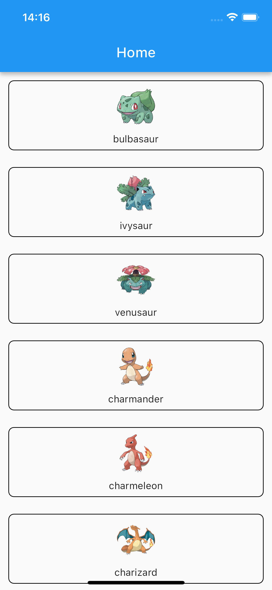

# pokedex_assignment

This is a basic Flutter application that utilizes the [PokeAPI](https://pokeapi.co/) to retrieve Pokémon data and present it below.

## Tools

- Flutter version 3.10.6
- Android Studio version 2022.1
- Android SDK version 33.0.2

## Assignment

Please add a new screen named `pokemon_detail` and fetch
Pokemon by url from homepage.

To identify where to add the necessary code, you can search for the `TODO!` comments within the existing codebase. These comments typically indicate places where additional code or specific tasks need to be implemented.

### Step

1. Implement a fetch fuction at [pokemon repositories](./lib/data/repositories/pokemon.dart
)
2. Create a new screen named `pokemon_detail`
3. Implement logic at `pokemon_detail_controller`
4. Add [page](./lib/routes/app_pages.dart) and [route](./lib/routes/app_routes.dart)
5. Implement a ontab routing function at [homepage](./lib/presentation/screens/home/home_screen.dart
)

We will utilize GetX for state management and routing in this project. To learn how to use it, please refer to the documentation provided at this [link](https://pub.dev/packages/get).
